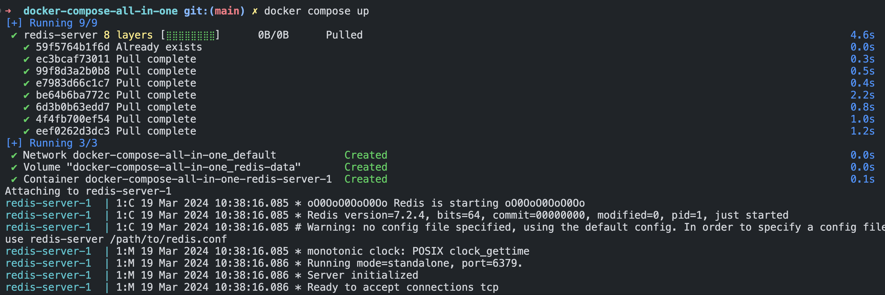
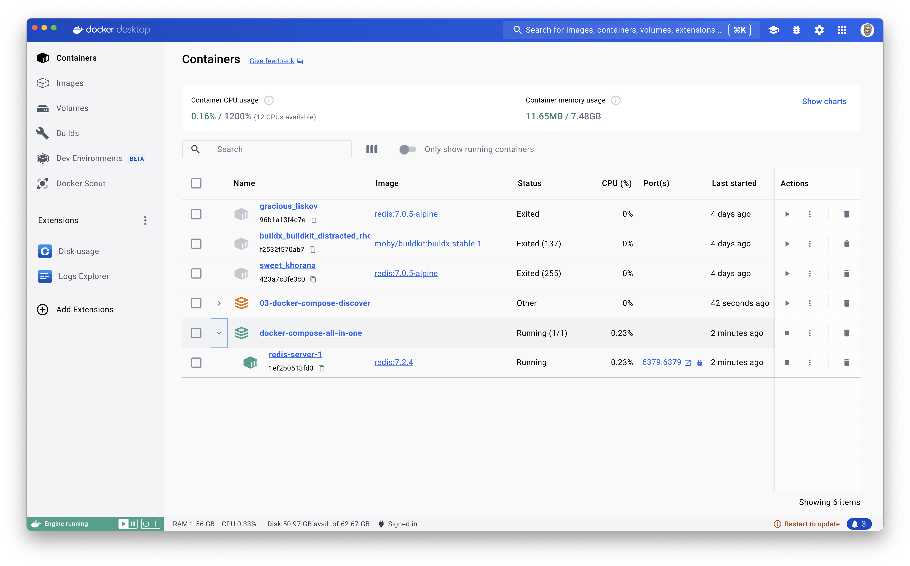
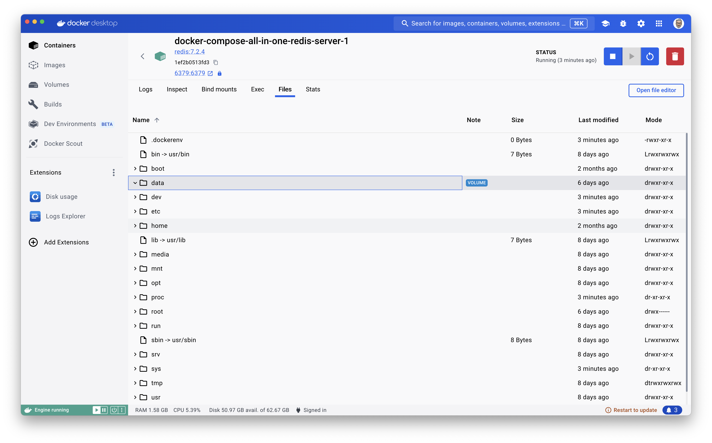
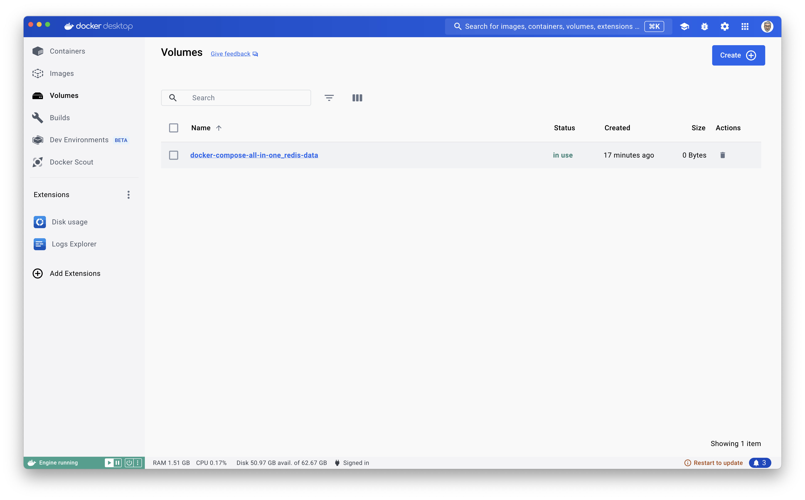
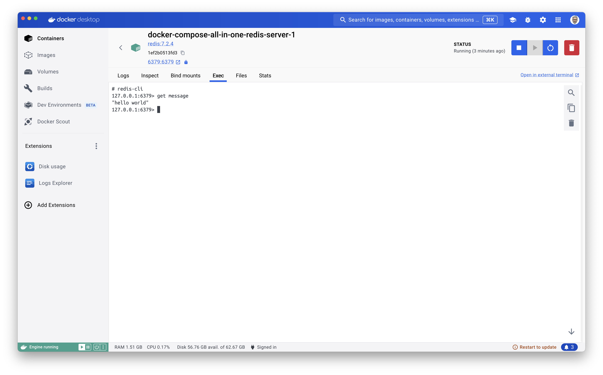
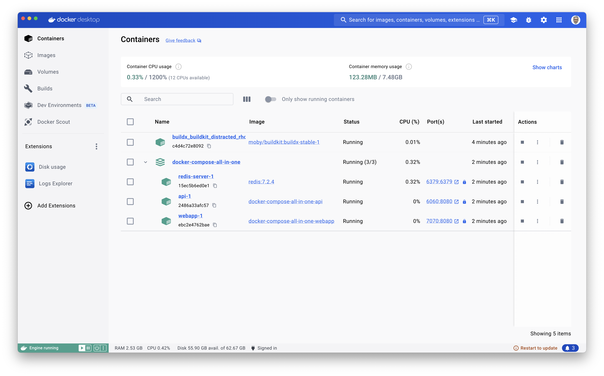
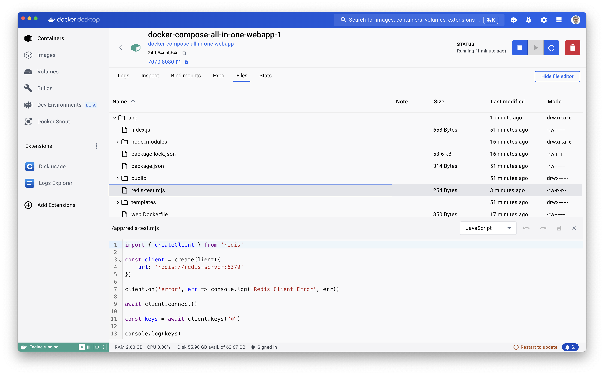
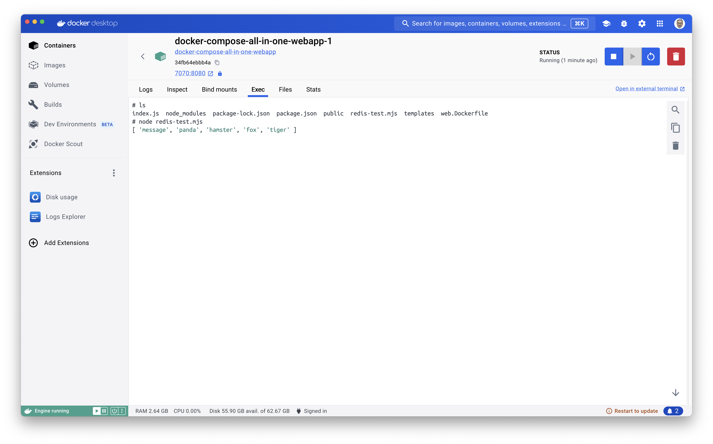
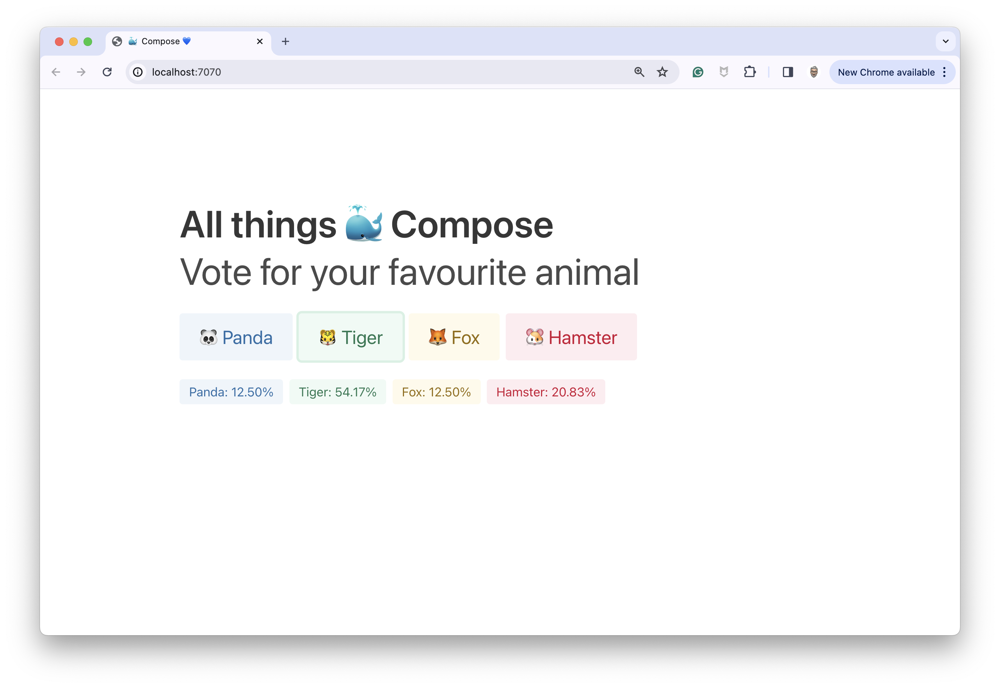
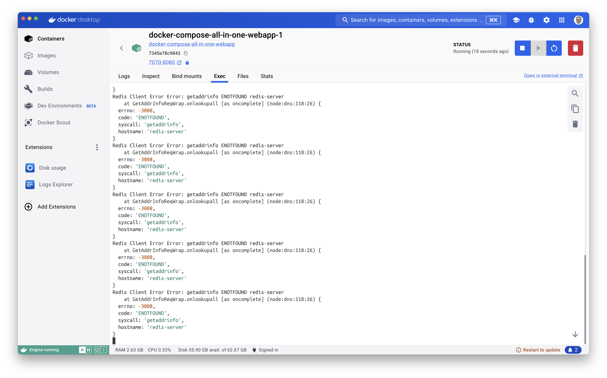

# Docker Compose all-in-one

- First, make temporary folder
- Navigate to this folder,
- And, then git clone this repository: https://github.com/docker-hands-on-exercises/docker-compose-all-in-one.git

```bash
git clone https://github.com/docker-hands-on-exercises/docker-compose-all-in-one.git
```

It you navigate to the `docker-compose-all-in-one` folder and open it with VSCode, you can see the rendered preview of the README.md file.

## 01- Create a Redis service

Open the `compose.yaml` file, and add this:

```yaml
services:

  redis-server:
    image: redis:7.2.4
    # Use your official image
    environment: 
      - REDIS_ARGS="--save 30 1"
    volumes:
      - redis-data:/data
    ports:
      - 6379:6379

volumes:
  redis-data:
```

Save the file, and type the following command (at the root of the folder):

```bash
docker compose up -d
```

You should get an output like this:



Then open the DD GUI:

> Go to the **Containers** section:


> At the **Files** tab, you can see that the `data` directory has been created:


> You can use the **redis-cli** from the **Exec** tab:


> Go to the **Volumes** section, a volume has been created:


Now if you stop Docker Compose with:

```bash
docker compose down
```

And restart it:

```bash
docker compose up -d
```

You can check that the data has been persisted:



## 02- Create the API and the WebApp service

Stop Docker Compose with:

```bash
docker compose down
```

Add this to the `compose.yaml` file (and save it):

```yaml
  api:
    build:        
      context: ./api
      dockerfile: api.Dockerfile
    environment:
      - FRONT_URL=http://localhost:7070
    ports:
      - 6060:8080
      # query the API on http://localhost:6060/counter
    depends_on:
      redis-server:
        condition: service_started

  webapp:
    build:        
      context: ./web
      dockerfile: web.Dockerfile
    environment:
      - API_URL=http://localhost:6060
    ports:
      - 7070:8080
      # open the webapp http://localhost:7070/
    depends_on:
      api:
        condition: service_started
```

And restart Docker Compose (and wait for a moment because og the build of the 2 services):

```bash
docker compose up -d
```

Go to the Docker Desktop GUI:



Click on the **[7070:8080](http://localhost:7070/)** link (of the `webapp-1` container), you can start voting for your favorite animal:


If you go to the **Containers** section and select the `webapp-1` container:


You can see in the **Files** tab, a `redis-test.mjs` file:



Then you can run it:


That means the front container can access to the redis server directly, without using the API.

Let's add some networks to fix this.

## 03- Add networks

Stop Docker Compose with:

```bash
docker compose down
```

And update the `compose.yaml` file (and save it) like this:

```yaml
services:

  redis-server:
    image: redis:7.2.4
    # Use your official image
    environment: 
      - REDIS_ARGS="--save 30 1"
    volumes:
      - redis-data:/data
    ports:
      - 6379:6379
    # 👋 add this:
    networks:
      - backend

  api:
    build:        
      context: ./api
      dockerfile: api.Dockerfile
    environment:
      - FRONT_URL=http://localhost:7070
    ports:
      - 6060:8080
      # query the API on http://localhost:6060/counter
    depends_on:
      redis-server:
        condition: service_started
    # 👋 add this:
    networks:
      - backend
      - frontend

  webapp:
    build:        
      context: ./web
      dockerfile: web.Dockerfile
    environment:
      - API_URL=http://localhost:6060
    ports:
      - 7070:8080
      # open the webapp http://localhost:7070/
    depends_on:
      api:
        condition: service_started
    # 👋 add this:
    networks:
      - frontend

volumes:
  redis-data:

# 👋 add this:
networks:
  frontend:
  backend:
```

Then restart Docker Compose:

```bash
docker compose up -d
```

You can still vote:



But you run again `node redis-test.mjs`, you cannot anymore access dircetly to the `redis-server`, from the `webapp` service:



